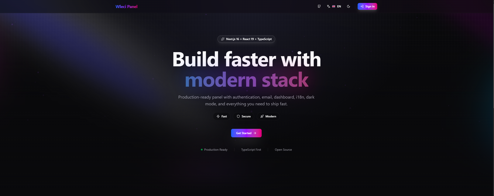

<div align="center">

# 🚀 Wleci Panel

### Next.js Fullstack Starter

Production-ready fullstack template with stunning UI, authentication, blog system, and everything you need to ship fast.

[](https://nextjs.org/)
[](https://react.dev/)
[](https://www.typescriptlang.org/)
[](https://tailwindcss.com/)
[](LICENSE)

</div>

<br/>

<div align="center">
  
</div>

<br/>

## ✨ Features

### 🔐 Authentication System
- Email/Password with validation
- Social Login (Google, Discord)
- Two-Factor Authentication (TOTP)
- Password recovery flow
- Email verification
- Session management
- Account lockout protection
- Login notifications
- Cloudflare Turnstile captcha

### 📧 Email System
- Nodemailer SMTP integration
- React Email templates
- Welcome emails
- Verification emails
- 2FA codes
- Password reset
- Login notifications
- Type-safe templates

### 📝 Blog System
- WYSIWYG editor (TipTap)
- Multi-language posts
- Categories & tags
- Featured posts
- Draft/publish workflow
- SEO optimization
- View tracking
- Admin panel

### 📊 Dashboard
- Modern sidebar navigation
- User profile management
- Avatar upload
- Session control
- Settings panel
- Admin panel
- Responsive design
- Dark mode support

### 🌍 Internationalization
- Multi-language (EN, PL)
- Client & server i18n
- Cookie-based persistence
- SEO-friendly routes
- Localized metadata
- Easy to extend

### 🎨 Modern UI
- shadcn/ui components
- Tailwind CSS 4
- Framer Motion animations
- Dark/Light mode
- Responsive design
- Aceternity UI effects
- Gradient backgrounds
- Smooth transitions

## 🏗️ Tech Stack

**Frontend:** Next.js 16 • React 19 • TypeScript 5  
**Styling:** Tailwind CSS 4 • shadcn/ui • Framer Motion  
**Backend:** Better Auth • Drizzle ORM • SQLite  
**Email:** Nodemailer • React Email  
**Validation:** Zod • t3-env  
**Security:** Cloudflare Turnstile • Security Headers

## 🚀 Quick Start

**Prerequisites:** Node.js 18+ or Bun

```bash
# 1. Clone the repository
git clone https://github.com/wleci/nextjs-fullstack-starter.git
cd nextjs-fullstack-starter

# 2. Install dependencies
npm install

# 3. Set up environment variables
cp .env.example .env
# Edit .env with your configuration

# 4. Initialize database
npm run db:push

# 5. Start development server
npm run dev
```

Open [http://localhost:3000](http://localhost:3000) 🎉

## 🔧 Configuration

### Essential Environment Variables

```env
# App Configuration
NEXT_PUBLIC_APP_URL=http://localhost:3000
NEXT_PUBLIC_APP_NAME=Wleci Panel

# Database
DATABASE_URL=sqlite.db

# Authentication
BETTER_AUTH_SECRET=your-secret-key-min-32-characters-long

# Email (SMTP)
SMTP_HOST=smtp.example.com
SMTP_PORT=587
SMTP_USER=your-email@example.com
SMTP_PASSWORD=your-password
SMTP_FROM=noreply@example.com
```

### Optional Features

```env
# Social Login
NEXT_PUBLIC_ENABLE_GOOGLE=true
GOOGLE_CLIENT_ID=your-client-id
GOOGLE_CLIENT_SECRET=your-client-secret

# Captcha Protection
NEXT_PUBLIC_ENABLE_CAPTCHA=true
TURNSTILE_SECRET_KEY=your-secret-key
NEXT_PUBLIC_TURNSTILE_SITE_KEY=your-site-key

# Features
NEXT_PUBLIC_ENABLE_BLOG=true
NEXT_PUBLIC_ENABLE_EMAIL=true
NEXT_PUBLIC_ENABLE_NEWSLETTER=true
```

---

## 📦 Available Scripts

```bash
# Development
npm run dev              # Start development server
npm run lint             # Run ESLint

# Database
npm run db:push          # Push schema to database
npm run db:generate      # Generate migrations
npm run db:migrate       # Run migrations
npm run db:studio        # Open Drizzle Studio

# Production
npm run build            # Build for production
npm run build:prod       # Standalone build (Docker-ready)
npm run start            # Start production server
npm run start:prod       # Start standalone server
```

---

## 📁 Project Structure

```
src/
├── app/
│   ├── [lang]/                    # Localized routes
│   │   ├── auth/                  # Authentication pages
│   │   ├── dashboard/             # User dashboard
│   │   ├── admin/                 # Admin panel
│   │   └── blog/                  # Blog pages
│   ├── api/                       # API routes
│   └── globals.css                # Global styles
├── components/
│   ├── layout/                    # Layout components
│   ├── ui/                        # UI components (shadcn/ui)
│   └── blog/                      # Blog components
├── lib/
│   ├── auth/                      # Authentication logic
│   ├── database/                  # Database setup
│   ├── email/                     # Email templates
│   ├── blog/                      # Blog logic
│   ├── i18n/                      # Internationalization
│   └── env/                       # Environment validation
└── middleware/                    # Next.js middleware
```

---

## 🎨 Customization

### Add New Language

1. Create translation file:
```bash
src/lib/i18n/dictionaries/de.json
```

2. Update environment:
```env
NEXT_PUBLIC_SUPPORTED_LOCALES=en,pl,de
```

3. Add flag icon in `language-switcher.tsx`

### Customize Theme

Edit `src/app/globals.css` to change colors:

```css
:root {
  --primary: oklch(0.21 0.006 285.885);
  --background: oklch(1 0 0);
  /* ... */
}
```

---

## 🔒 Security Features

✅ Security headers (CSP, HSTS, X-Frame-Options)  
✅ GDPR-compliant cookie consent  
✅ Rate limiting on authentication  
✅ Account lockout after failed attempts  
✅ Cloudflare Turnstile bot protection  
✅ Input validation with Zod  
✅ SQL injection protection (Drizzle ORM)  
✅ XSS protection  
✅ CSRF protection

## 🤝 Contributing

Contributions are welcome! Please feel free to submit a Pull Request.

## 📄 License

This project is licensed under the MIT License - see the [LICENSE](LICENSE) file for details.

---

<div align="center">

### Built with ❤️ using modern web technologies

**[Next.js](https://nextjs.org/)** • **[React](https://react.dev/)** • **[TypeScript](https://www.typescriptlang.org/)** • **[Tailwind CSS](https://tailwindcss.com/)** • **[Better Auth](https://better-auth.com/)**

⭐ Star this repo if you find it helpful!

</div>
